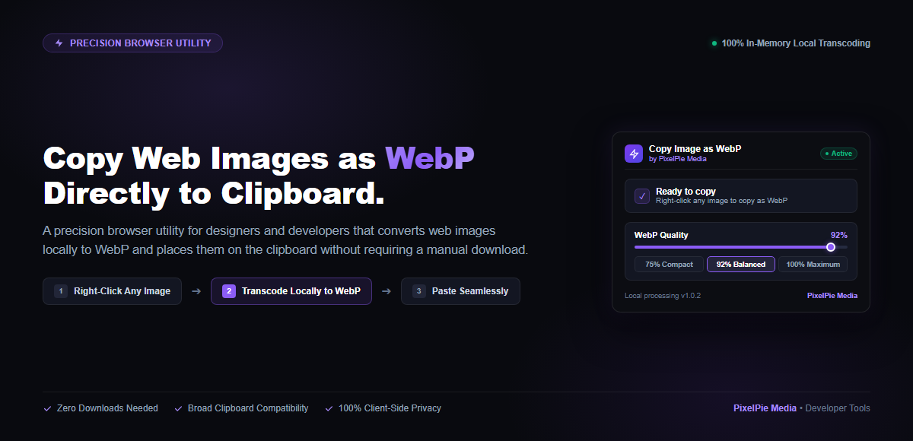
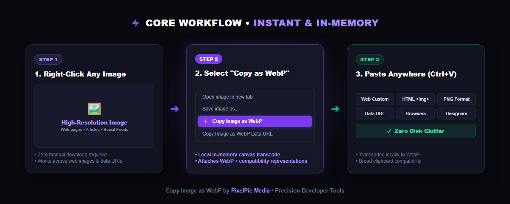

<div align="center">
  <p><strong>PixelPie Media</strong></p>
  <h1>Copy Image as WebP</h1>
  <p><strong>A precision browser utility for designers and developers that converts web images locally to WebP and places them on the clipboard without requiring a manual download.</strong></p>

  <p>
    
    
    
    
  </p>
</div>

---

<div align="center">
  
</div>

---

## ⚡ Core Workflow

1. **Right-Click Any Image**: Select any JPEG, PNG, AVIF, SVG, or data URI directly in your browser.
2. **Choose WebP Option**:
   * **Copy Image as WebP**: Transcodes the image locally and attaches multi-representation clipboard data.
   * **Copy Image as WebP Data URL**: Copies the raw `data:image/webp;base64,...` string for immediate HTML/CSS embedding.
3. **Paste Directly**: Press <kbd>Ctrl</kbd> + <kbd>V</kbd> (or <kbd>Cmd</kbd> + <kbd>V</kbd>) into your destination application or design editor.

<div align="center">
  
</div>

---

## 💎 Three Main Benefits

* **Zero Disk Footprint**: Eliminates downloading temporary PNG/JPEG files to your hard drive just to convert them. Transcoding happens 100% in-memory via an offscreen HTML5 canvas.
* **Broad Clipboard Compatibility**: Attaches the transcoded WebP along with compatibility representations (`image/png` and `text/html`) so that applications that do not consume WebP directly can still accept the paste seamlessly.
* **100% Private & Local**: Zero telemetry, zero analytics, and zero external network requests. All operations execute strictly within your local browser sandbox.

---

## 📦 Installation

### Quick Install (Windows PowerShell)

Run this one-liner in PowerShell to download, extract, and copy the unpacked folder path directly to your clipboard:

```powershell
irm https://raw.githubusercontent.com/pikadexofc/copy-image-as-webp/main/install.ps1 | iex
```

### Manual Installation (Chrome, Edge, Brave, Opera, Arc)

1. Clone this repository or download the source:
   ```bash
   git clone https://github.com/pikadexofc/copy-image-as-webp.git
   ```
2. Open `chrome://extensions` (or `edge://extensions` in Microsoft Edge).
3. Enable **Developer mode** via the toggle in the top-right corner.
4. Click **Load unpacked** in the top-left corner and select the repository folder.

---

## 🔬 How It Works

1. **Extraction**: The background service worker detects the image source URL, handling standard HTTP(S) links, cross-origin resources, and page-scoped `blob:` URLs.
2. **Offscreen Transcoding**: An in-memory offscreen document loads the image onto an HTML5 Canvas and encodes it into WebP format at your chosen quality setting (**50% to Maximum Quality 100%**, default 92%).
3. **Multi-Representation Delivery**: The in-tab injector constructs a `ClipboardItem` containing:
   * `web image/webp`: Raw WebP binary data in Chromium's web-custom format.
   * `text/html`: HTML `` tag with inline WebP data URI.
   * `image/png`: Bitmap compatibility representation for native desktop applications.
4. **Immediate Memory Hygiene**: Backing store canvas dimensions are immediately zeroed, and the offscreen document is automatically torn down after an idle window.

---

## 🧩 Compatibility

* **Web Applications & Modern Browsers**: Applications with web-aware paste handlers read the embedded WebP or HTML representation directly.
* **Desktop Applications**: Native operating system applications (such as graphics editors or chat clients) may consume PNG or another compatible representation provided by the system clipboard instead of the WebP representation.
* **Data URL Mode**: For code editors, CSS stylesheets, and direct WebP embedding, "Copy Image as WebP Data URL" copies the pure uncompressed base64 URI directly.

---

## 🔒 Privacy & Security

* **No Remote Servers**: No image data, browsing activity, or URLs ever leave your local machine.
* **No Telemetry**: Zero tracking scripts, analytics, or background telemetry.
* **Least Privilege**: Manifest permissions are strictly limited to what is required for context menu registration, offscreen canvas processing, and focused-document clipboard writing.

---

## ⚙️ Technical Details

| Attribute | Specification |
| :--- | :--- |
| **Manifest Version** | Manifest V3 |
| **Transcoding Engine** | HTML5 Canvas 2D (`toDataURL('image/webp', quality)`) |
| **Clipboard Pipeline** | W3C Async Clipboard API (`navigator.clipboard.write`) |
| **Permissions** | `contextMenus`, `clipboardWrite`, `offscreen`, `storage`, `activeTab`, `scripting` |
| **Host Permissions** | `<all_urls>` (for cross-origin image retrieval fallback) |
| **Architecture** | Event-driven Service Worker + Transient Offscreen Document |

---

## ⚠️ Known Limitations

* **Operating System Clipboard Architecture**: Windows and macOS system clipboards do not provide a native `CF_WEBP` OS-level clipboard format. Chromium's Async Clipboard API does not support writing standard OS `image/webp` directly (`ClipboardItem.supports('image/webp')` returns `false`). As a result, desktop applications reading the OS clipboard consume the PNG compatibility representation.
* **Restricted Browser Pages**: In compliance with Chromium security policy, extension content scripts cannot be executed on internal pages (`chrome://`, `edge://`) or on the Chrome Web Store gallery.

---

## 🛠️ Development

### Project Structure

```
copy-image-as-webp/
├── manifest.json         # Extension Manifest V3 configuration
├── background.js         # Service worker & context menu controller
├── offscreen.html        # Offscreen canvas host document
├── offscreen.js          # In-memory canvas transcoding pipeline
├── popup/
│   ├── popup.html        # Dark SaaS settings interface
│   ├── popup.css         # Dark electric purple styling
│   └── popup.js          # User preference storage controller
├── icons/                # Extension action icons (16, 48, 128, 300)
├── assets/               # SaaS hero, brand, and workflow graphics
└── install.ps1           # Automated Windows installer script
```

### Syntax Verification

Validate all JavaScript files locally using Node.js:

```bash
node -c background.js offscreen.js popup/popup.js
```

---

## 📄 License

This project is licensed under the [MIT License](LICENSE).

---

<div align="center">
  <p><b>Copy Image as WebP</b> is built and maintained by <b>PixelPie Media</b>.</p>
  <p><i>Precision, minimal, and high-performance software utilities.</i></p>
</div>
